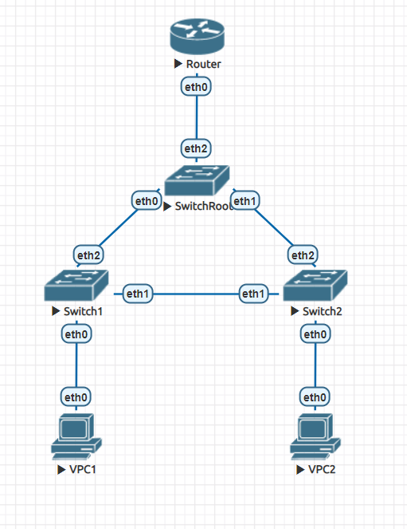
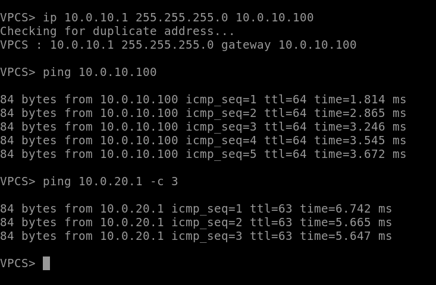
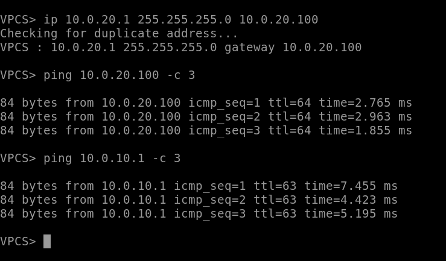
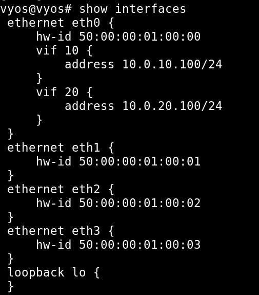
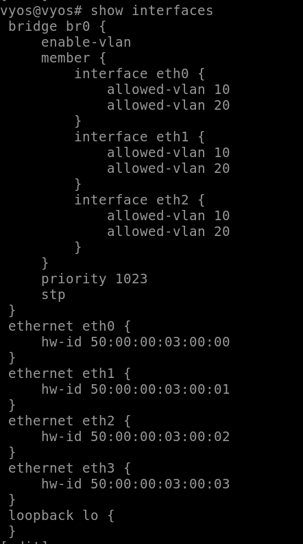
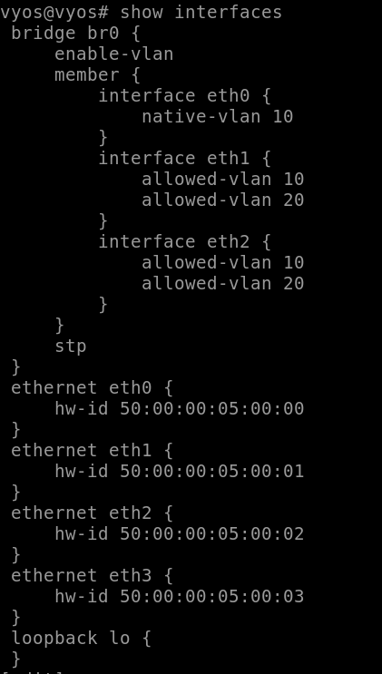
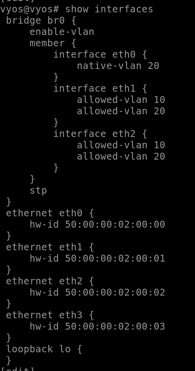
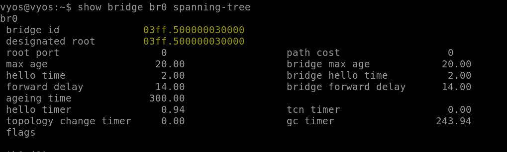
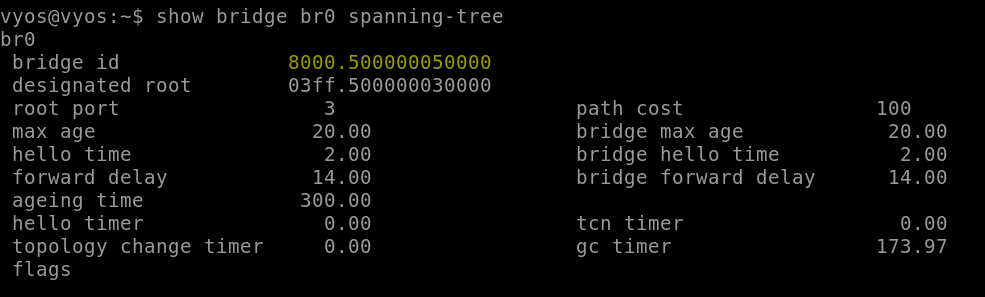
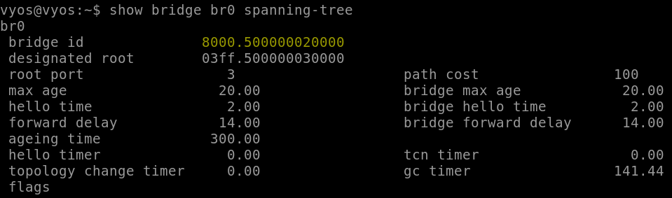

## Топология:

## Пинги:
На первом клиенте (до роутера и второго клиента):

На втором клиенте (до роутера и первого клиента):

## Интерфейсы:
На маршрутизаторе:

На корневом коммутаторе:

На коммутаторе, уходящем в подсеть vlan10:

На коммутаторе, уходящем в подсеть vlan20:

## STP
На корне (видно, что он выбран корневым коммутатором (был выбран по priority)):

На коммутаторе-1:

На коммутаторе-2:

