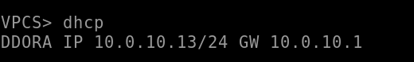

## Схема:

## Клиенты

### Получение сетевых настроек по DHCP:
Первый клиент:

Второй клиент:

### Пинги:
Первый клиент (второго клиента и внешнего роутера):

Второй клиент (первого клиента и внешнего роутера):

## Конфигурации:
Конфигурация коммутаторов с первого дз не менялась. Основные изменения затронули первый (нижний) роутер.

Конфигурация dhcp:

dhcp-leases после того, как какие-то клиенты получили настройки:

Трансляции SNAT после ping-ов (был реализован PAT по примеру из семинара, который менял source-адрес у запросов, подпадающих в указанное подмножество):

