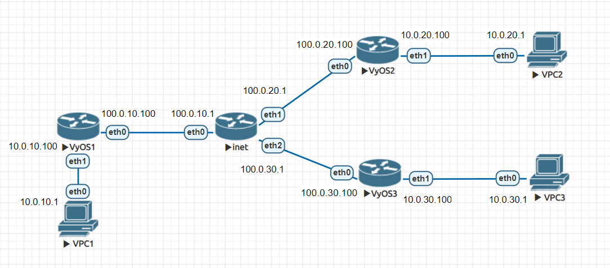
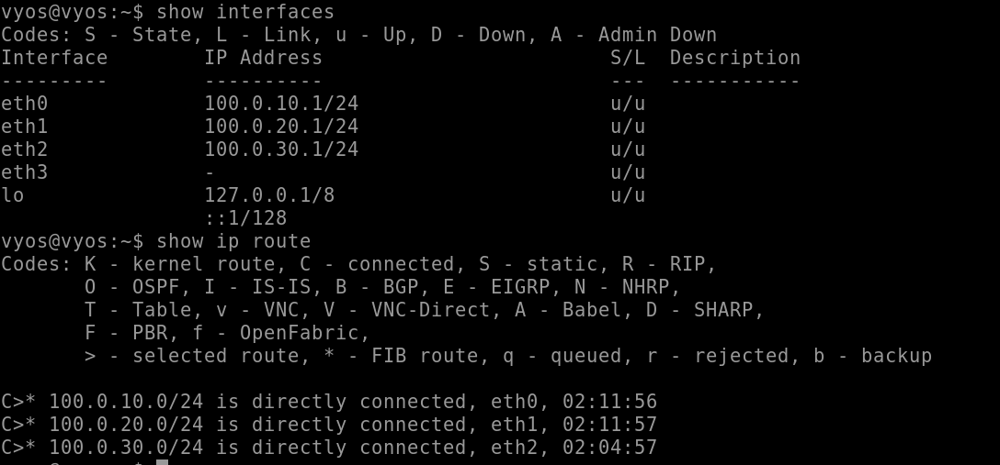
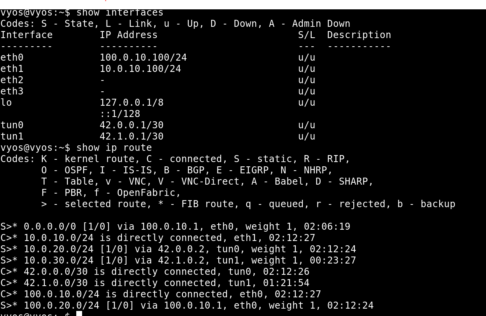
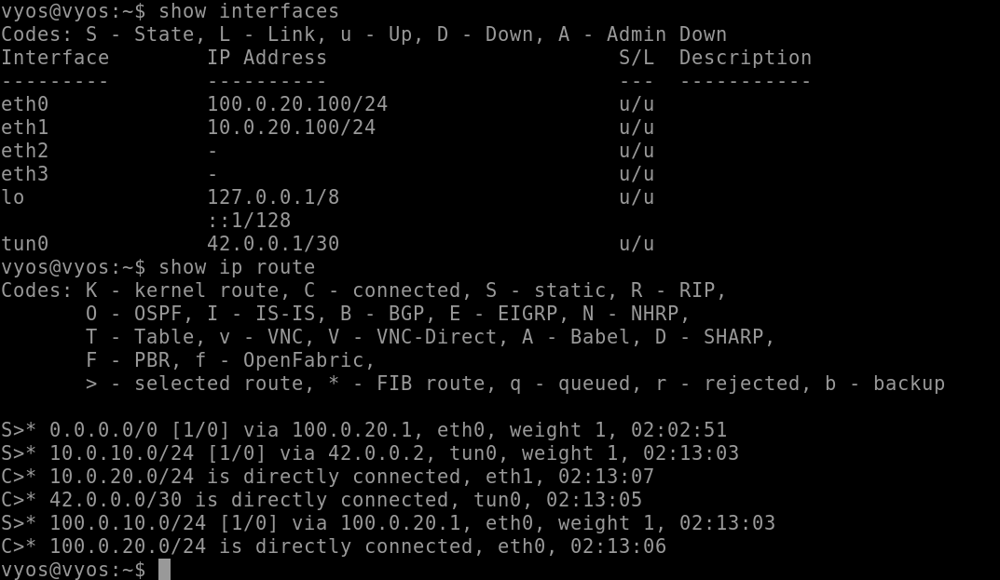
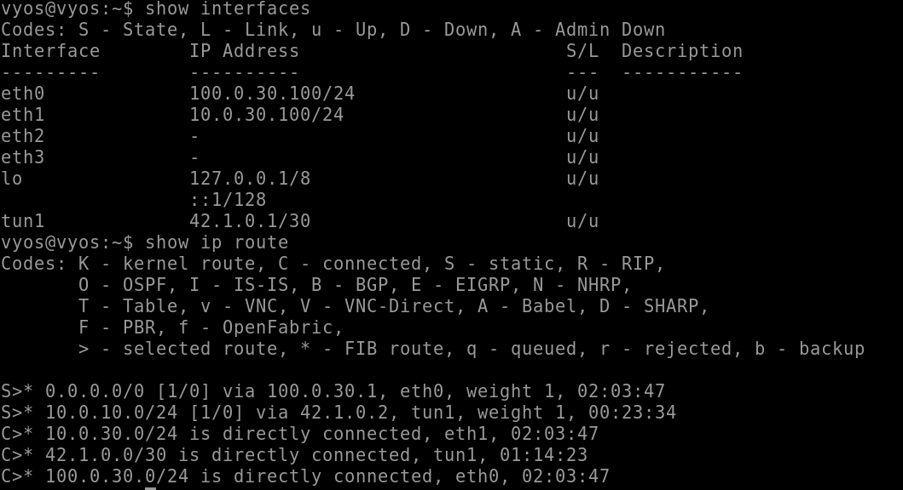
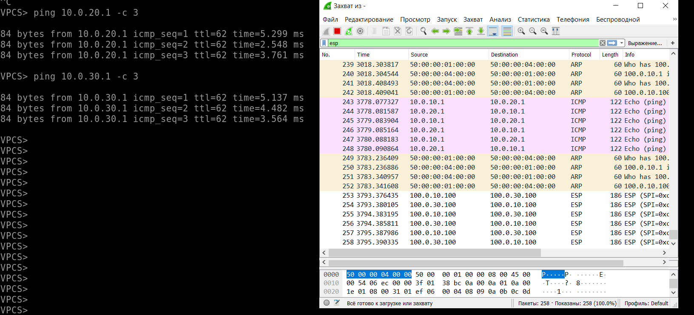
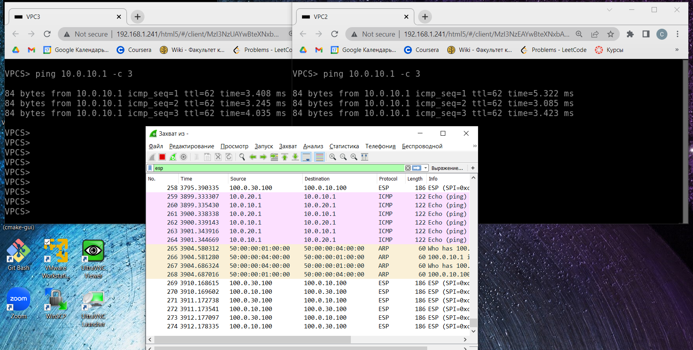

## Топология:

## Интерфейсы:
Маршрутизатор, эмулирующий интернет:

Пограничный маршрутизатор-1 (на нем настроены и GRE, и GRE + IPSec):

Пограничный маршрутизатор-2 (GRE):

Пограничный маршрутизатор-3 (GRE + IPSec):

## Пинги:
Пинги, исходящие от клиента-1 (vpc-1 на схеме):

Пинги приходящие к клиенту-1 от клиента-2 и клиента-3:

Видно, что пакеты между клиентом-1 и клиентом-3 шифруются (использовалась аутентификация с обменом ключей).
